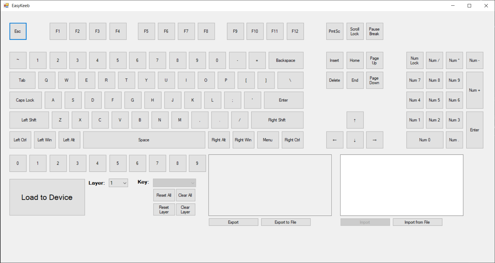

# EasyKeeb

The EasyKeeb is an Arduino based device that connects between any USB keyboard and PC to provide additional features and personalization. A keymap is generated using an intuitive GUI, reassigning keys and allowing for multiple [layers](https://thomasbaart.nl/2018/12/06/qmk-basics-how-to-add-a-layer-to-your-keymap/#What_is_a_layer). The user can also connect extra switches (such as buttons, toggle switches, footpedals, etc) and assign those in the same way. Because the keymap is contained in the device, it can be used on any computer without the need to install drivers or other software and layouts can be serialized in JSON to be shared or saved for later with one click.

The main components of the EasyKeeb are an ATmega32u4 connected to a MAX3421E.